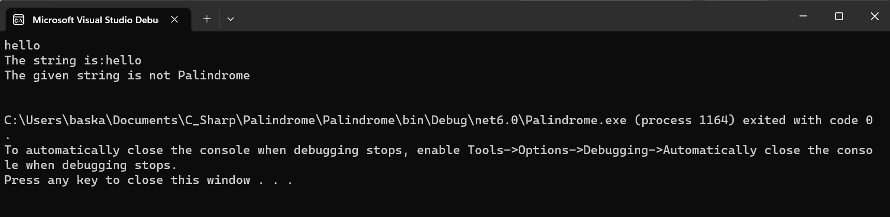

# Palindrome

## AIM:
To write a C# program to find whether the given string is a Palindrome or not.

## ALGORITHM:
Step 1:
To start the C# program in visual Studio 2022.

Step 2:
Create a class and declare two variable with string datatype.

Step 3:
Loop over the entire string and reverse it.

Step 4:
Use if condition to check whether the string and the reversed string is equal or not.

Step 5:
Print palindrome if it's equal else print not a palindrome.

Step 6:
Save the program and run the program in visual studio 2022.

## PROGRAM:
```
/*
Developed by: PAARKAVY B 
Register Number: 212221230072 
*/
```

```
using System;
namespace PALINDROME
{
    public class Palindrome
    {
        static void Main(string[] args)
        {
            string word, reverse = "";
            word = Convert.ToString(Console.ReadLine());
            Console.WriteLine("The string is:" + word);
            for (int i = word.Length - 1; i >= 0; i--)
            {
                reverse += word[i];
            }
            if (reverse == word)
            {
                Console.WriteLine("The given string {0} is Palindrome", reverse);
            }
            else
            {
                Console.WriteLine("{0} its not Palindrome", reverse);
            }
            Console.ReadLine();
        }
    }
}
```

## OUTPUT:




## RESULT:
Thus the C# program to display whether the given string is Palindrome or not is executed successfully.
